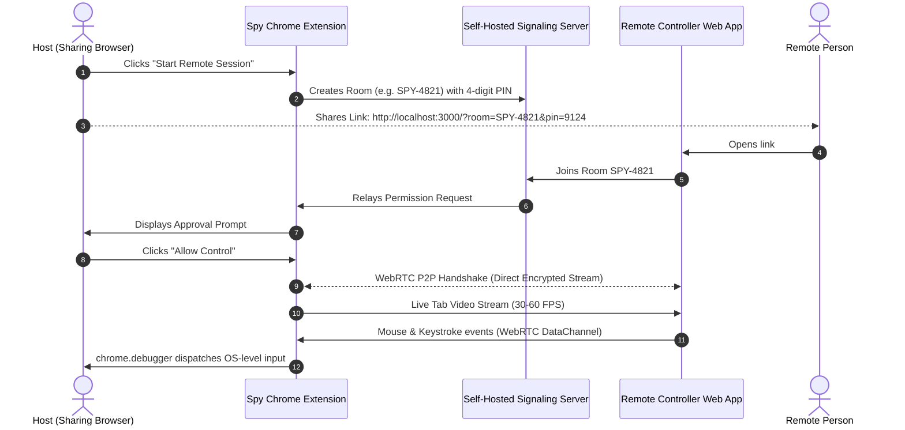

# Spy Extension 👁️⚡

> **Peer-to-Peer Remote Browser Control with Mutual Two-Party Consent.**  
> Zero third-party cloud dependencies &bull; Ultra-low latency WebRTC &bull; Chrome DevTools Protocol (CDP) &bull; Self-Hostable.

> [!WARNING]
> **DISCLAIMER & ACCEPTABLE USE WARNING**  
> This software is created **strictly for legitimate, consensual remote collaboration, tech support, and co-browsing between two willing parties**.  
> The authors and contributors **expressly disclaim all liability and responsibility** for any misuse, unauthorized surveillance, malicious activity, damage, or harm caused by the use or modification of this project. Users are solely responsible for complying with all applicable laws and obtaining explicit authorization before initiating any remote control session.

---

## 📖 Overview

**Spy Extension** allows you to give remote control of your browser tab to another person (friend, coworker, developer, support agent). 

### Key Highlights
- **No Third-Party Vendor Lock-in**: Uses native browser WebRTC (`RTCPeerConnection` & `RTCDataChannel`) with standard open STUN (`stun.l.google.com:19302`) and your own self-hosted signaling server. No external proprietary SDKs, no SaaS billing, no usage limits.
- **Controller Needs No Extension**: The remote person simply opens an HTTPS/HTTP URL in any modern browser (Chrome, Firefox, Safari, Edge).
- **Two-Party Mutual Consent**: Remote access is strictly blocked until the host explicitly clicks **"Allow Control"** or **"View Only"** upon connection.
- **Genuine Hardware Input Simulation**: Uses Chrome DevTools Protocol (`chrome.debugger`) to dispatch native clicks, typing, scrolling, and dragging without DOM injection hacks.
- **Emergency Kill Switch**: The host can revoke access or terminate the connection instantly at any time.

---

## 🏗️ Architecture



---

## 📁 Project Structure

```
spy-extension/
├── extension/                 # Chrome Extension (Manifest V3)
│   ├── manifest.json         # Manifest V3 permissions & config
│   ├── background.js         # Service Worker: chrome.debugger CDP dispatcher
│   ├── offscreen.html        # Offscreen document for WebRTC tab capture
│   ├── offscreen.js          # WebRTC PeerConnection & DataChannel handler
│   ├── popup/                # Extension Popup UI
│   │   ├── popup.html
│   │   ├── popup.css
│   │   └── popup.js
│   └── icons/                # Extension icons
├── server/                    # Self-Hosted Signaling & Web Controller Server
│   ├── package.json
│   ├── server.js             # HTTP static server + WebSocket signaling
│   └── public/               # Remote Controller Web App
│       ├── index.html        # Interactive video canvas & remote viewport
│       ├── style.css         # Dark theme UI
│       └── controller.js     # WebRTC client & input event capture
└── README.md
```

---

## 🚀 Getting Started

### Step 1: Start the Signaling Server & Web Client
In your terminal, navigate to the `server/` directory and install dependencies:

```bash
cd server
npm install
npm start
```
By default, the server starts on `http://localhost:3000`.

---

### Step 2: Install the Host Chrome Extension
1. Open Google Chrome (or Brave / Edge).
2. Navigate to `chrome://extensions/`.
3. Enable **Developer mode** (toggle in the top-right corner).
4. Click **Load unpacked** and select the `/root/spy-extension/extension` directory.
5. The **Spy Extension** icon will now appear in your browser toolbar!

---

### Step 3: Start a Session & Share Access
1. Navigate to the tab you want to share (e.g., any web app, docs, code editor).
2. Click the **Spy Extension** icon in your toolbar.
3. Click **🚀 Start Remote Session**.
4. Click **📋 Copy Controller Link**.
5. Send the link to the remote person (e.g., `http://localhost:3000/?room=SPY-XXXX&pin=YYYY`).

---

### Step 4: Remote Person Connects
1. The remote person opens the link in their browser.
2. The Room ID and PIN are auto-populated. They click **Request Access**.
3. On the Host machine, the extension popup displays:  
   `⚠️ Remote client requested access. Allow?`
4. The host clicks **"Allow Control"** (or **"View Only"**).
5. The live stream begins immediately over direct WebRTC!

---

## 🔒 Security & Privacy

- **Native Chrome Debugger Warning**: Whenever remote control is active, Chrome displays a native warning banner (*"Spy Extension started debugging this browser"*). This ensures full transparency.
- **PIN Authorization**: Every session generates a random 4-digit PIN to prevent unauthorized room joins.
- **Host Override**: The host's physical mouse and keyboard always take precedence over remote inputs.
- **Zero Cloud Video Storage**: Tab video is streamed purely peer-to-peer (P2P) in memory. No video or keystrokes are ever saved or stored on any server.

---

## 🌐 Production Deployment

To make the signaling server accessible across the internet:
1. Deploy `server/` to any Node.js host (e.g., VPS, Docker, Render, Railway, Fly.io, or AWS EC2).
2. Configure your custom WebSocket URL (e.g. `wss://signaling.yourdomain.com`) in the extension popup under **⚙️ Signaling Server Settings**.

---

## ⚠️ Disclaimer & Legal Notice

1. **Mutual Consent Only**: This software is designed and intended solely to allow two consenting parties to share and control a browser session transparently.
2. **No Liability**: The author(s) and copyright holder(s) of this project are **not responsible or liable** for any illicit, unethical, or harmful use of this software, including but not limited to unapproved computer access, stalking, harassment, data breaches, or legal violations committed by third parties.
3. **End-User Responsibility**: You are solely responsible for ensuring your use of this software conforms with local and international cyber laws, computer fraud statutes, and privacy regulations. Any unauthorized use against an unwilling individual or unauthorized device is strictly prohibited.

---

## 📄 License
MIT License. Built for open, transparent, and collaborative remote browsing.
